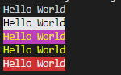

# Colored Text in Console

Small library (zero dependency) to display colored text in the console.

## Basic Usage

1. Initialize
```js
const ctext = require('ctext');

const ymu = new ctext({
  color: 'yellow', // or ctext.colors.yellow
  bgColor: 'magenta', // or ctext.bgColors.magenta
  format: 'underscore' // or ctext.format.underscore
});
```
2. Use
```js
console.log(ymu.text('Hello World'));
```

## Code and output samples

```js
const ctext = require('ctext');

// text with no styling
const dText = new ctext();

// text with black color and white background
const bw = new ctext({
  color: 'black', 
  bgColor: 'white'
});

// parameters can be passed using colors, bgColors, and format attributes
const ymu = new ctext({
  color: ctext.colors.yellow,
  bgColor: ctext.bgColors.magenta,
  format: ctext.format.underscore
});

const y = new ctext({
  color: ctext.colors.yellow
});

const dr = new ctext({
  bgColor: ctext.bgColors.red
});

console.log(dText.text('Hello World'));
console.log(bw.text('Hello World'));
console.log(ymu.text('Hello World'));
console.log(y.text('Hello World'));
console.log(dr.text('Hello World'));
```

Output

